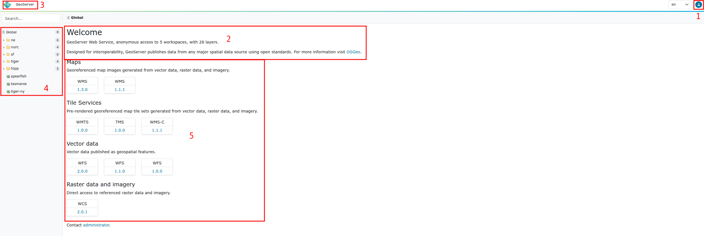
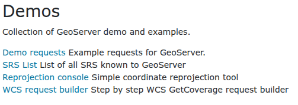
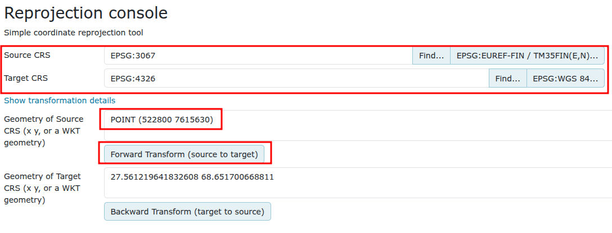
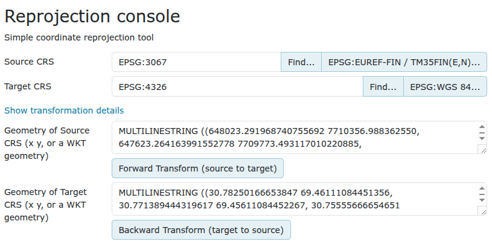
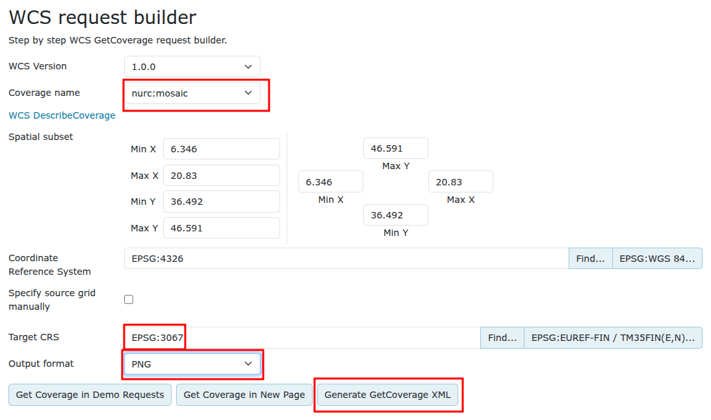

# HARJOITUS 1.1: ASENNUS JA KÄYTTÖÖNOTTO

**Harjoituksen sisältö**

Olemassa olevaan GeoServer-palvelimeen otetaan yhteys web-selaimen kautta. Opitaan muokkaamaan palvelimen yleistietoja ja asettamaan ylläpitäjän käyttäjäprofiilitiedot (tunnus ja salasana).

**Harjoituksen tavoite**

Harjoituksen jälkeen opiskelija osaa kirjautua ylläpitäjänä GeoServeriin ja tuntee yleisellä tasolla sen käyttöliittymän.

**Arvioitu kesto**

40 minuuttia.

## **Valmistautuminen**

Käynnistä koneessa web-selain.

Jos käytössä on etäpalvelin, kysy oma ip-osoitteesi ja portti kurssin vetäjältä.

Mikäli harjoittelet paikallisella GeoServer-asennuksella niin osoite on todennäköisesti

::: note-box
http://localhost:8080/geoserver
:::

Edessäsi on GeoServerin käyttöliittymä. Ennen kuin kirjaudut sisään, näet muutamia yleisiä tietoja palvelimesta.

**Ylhäällä oikealla (1)** pääset kirjautumaan painamalla symbolia.

**Ylhäällä keskellä (2)** on kootusti tietoja palvelimen workspaceista ja tasoista.

**Ylhäällä vasemmalla (3)** on GeoServer-logo ja kun sitä painaa niin pääsee tähän etusivulle.

**Vasemmalla (4)** on valikko jonka kautta voi nähdä workspacet ja tasot.

**Keskellä (5)** on palvelimen tukemat karttapalvelut ja niiden versiot.

Kirjaudu nyt palvelimeen käyttäen tunnuksena **admin** ja salasanana **gispo**. Kun olet kirjautunut GeoServeriin niin näet myös ylävalikon toiminnot.

:::hint-box
GeoServerin oletusasennuksessa on kaksi käyttäjäprofiilia, **master** ja **admin**. Salasanat on vaihdettu oletuksesta seuraavalla tavalla:

**master** →  gispogispo

**admin** →   gispo

:::

## **Ylävalikko**

Ylävalikon kautta navigoit eri osien välillä. Tässä harjoituksessa keskitytään Geoserver-valikon osioihin.

-   **Welcome** -osio vie sinut aloitusnäkymään. Näet nyt enemmän tietoja, esimerkiksi sivun alalaidassa kyseisen GeoServerin version.

-   **Browse Layers** -osiossa voit esikatsella tasoja. Käy esikatselemassa muutamia tasoja esim. OpenLayers-formaatissa. Käytä nyt muutama minuutti oppiaksesi osion perustoiminnallisuudet.

-   **Demos**-osion kautta voi tutustua muutaman demoon ja esimerkkiin.

-   **About** -osio kertoo tarkemmin GeoServerin asennuksen tietoja ja antaa linkkejä GeoServerin dokumentaatioon. GeoTools- ja GeoWebCache-ohjelmistojen versiotiedot voit tarkistaa myös tältä sivulta.

### **Palvelutoiminnallisuudet**

Palaa palvelimen pääsivulle painamalla **GeoServer-logoa**.

GeoServerille on asennettu oletuksena useita eri rajapintapalveluja. Muita rajapintapalveluita, kuten esimerkiksi WPS-palvelu, voidaan julkaista GeoServeriin laajennusten avulla. Painamalla rajapintapalvelujen versionumeroita, voit tutustua niiden toiminnallisuuksiin (capabilities).

Tämä osio on nähtävissä vain aloitussivulla. Muista, että aloitussivuun pääset aina painamalla GeoServer-logoa.

### **Demos**

Palataan takaisin **Demos**-osiolle. 

Tämän osion alta löytyy muutamia GeoServerin testityökaluja:\

### **Demo requests**

Kokeile erilaisten kyselyjen (toiminnallisuuksien) tuloksia ja näe, mitä kukin kyselykomento tuottaa. Kokeile **WMS_getMap_OpenLayers.url**-kyselyn toimivuutta valitsemalla kyseinen kysely valikosta ja paina **Show Result** -toimintoa.

GeoServerin eri toiminnot ja operaatiot muodostuvat URL:n liittyvistä parametreistä. Parametrit ohjaavat GeoServerin rajapintapalveluita: mitä karttatasoa kysytään, miltä alueelta tietoja haetaan tai kuva muodostetaan, vastauksen koordinaattijärjestelmä jne.

Muokkaa kyselyn parametrejä BBOX, WIDTH ja HEIGHT. Mitä vaikutuksia muutoksilla on vastaukseen?

### **SRS List ja Reprojection console**

SRS List -toiminto listaa GeoServerin tukemat koordinaattijärjestelmät. GeoServer sisältää suurimman osan käytettävistä koordinaattijärjestelmistä eli CRS:t (Coordinate Reference System). SRS (Spatial Reference System) on synonyymi CRS:lle.

Koordinaattijärjestelmien välisiä muunnoksia ja konversioita voit kokeilla Reprojection Console-toiminnon avulla.

Koordinaatit esitetään WKT-formaatissa (Well Known Text).

Seuraavassa kuvassa on pistegeometria määritelty WKT-formaatissa EPSG:3067 koordinaattijärjestelmässä **POINT (522800 7615630)**:

Voit myös kokeilla ETRS89 / TM35FIN -viivageometriaa. Löydät esimerkin seuraavassa laatikossa.

::: file-content-box
MULTILINESTRING ((648023.291968740755692 7710356.988362550, 647623.264163991552778 7709773.493117010220885,
647025.100957126589492 7709395.217135690152645, 646919.555495914653875 7709322.892699570395052, 646428.536749321036041 
7708986.160282356664538, 646070.417665179818869 7708777.868454321287572))
:::

Kopioi laatikon sisältö ja käytä sitä **Reprojection console** -työkalussa. Kokeile muuntaa se esimerkiksi WGS 84 -järjestelmään.

## **WCS request builder**

Tämän toiminnon avulla voit kokeilla Web Coverage Service -palvelun toimivuutta.

Lataa **nurc:mosaic**-aineisto PNG-tiedostona Suomen kansallisessa koordinaattijärjestelmässä (**ETRS89/TM35FIN** (EPSG 3067)). Jätä muut asetukset oletusarvoiksi:

Paina lopussa **Generate Coverage XML** ja tarkastele tulosta.
