# HARJOITUS 1.2: GEOSERVERIN WEB-KÄYTTÖLIITTYMÄ

**Harjoituksen sisältö**

Harjoituksessa tutustutaan tarkemmin GeoServerin päätoimintoihin käyttöliittymän kautta. Käydään läpi käyttöliittymän eri osioiden valintoja ja tärkeimpiä ominaisuuksia.

**Harjoituksen tavoite**

Harjoituksen jälkeen opiskelija ymmärtää GeoServerin toimintaa ja eri osioiden hallintatyökaluja.

**Arvioitu kesto**

35 minuuttia.

## **Ylläpitäjän käyttöliittymä**

Kirjaudu nyt palvelimeen käyttäen tunnuksena **admin** ja salasanana **gispo**.

Ylävalikosta löytyviä GeoServerin toimintoja on ryhmitelty niiden käyttötarkoituksen mukaan ryhmiin:

+--------------------------+----------------------------------------------------------------------------+
| ##### **GeoServer**      | Yleistä tietoa GeoServerin asennuksesta ja esikatseluosio                  |
+--------------------------+----------------------------------------------------------------------------+
| ##### **Data**           | Sisältää aineiston lataamisen, määrittämisen ja kuvaustekniikan toimintoja |
+--------------------------+----------------------------------------------------------------------------+
| ##### **Services**       | Valikossa voi määritellä eri paikkatietopalvelujen ominaisuuksia           |
+--------------------------+----------------------------------------------------------------------------+
| ##### **Server**         | Yleisiä asetuksia liittyen palvelimeen                                     |
+--------------------------+----------------------------------------------------------------------------+
| ##### **Tile Cache**     | Karttatiilipalvelujen asetukset                                            |
+--------------------------+----------------------------------------------------------------------------+
| ##### **Security**       | Pääsynhallintaan liittyviä asetuksia                                       |
+--------------------------+----------------------------------------------------------------------------+
| ##### **Utilities**      | Lisätyökaluja                                                              |
+--------------------------+----------------------------------------------------------------------------+

\
Näiden lisäksi GeoServerin laajennukset voivat lisätä valikkoja käyttöliittymään.

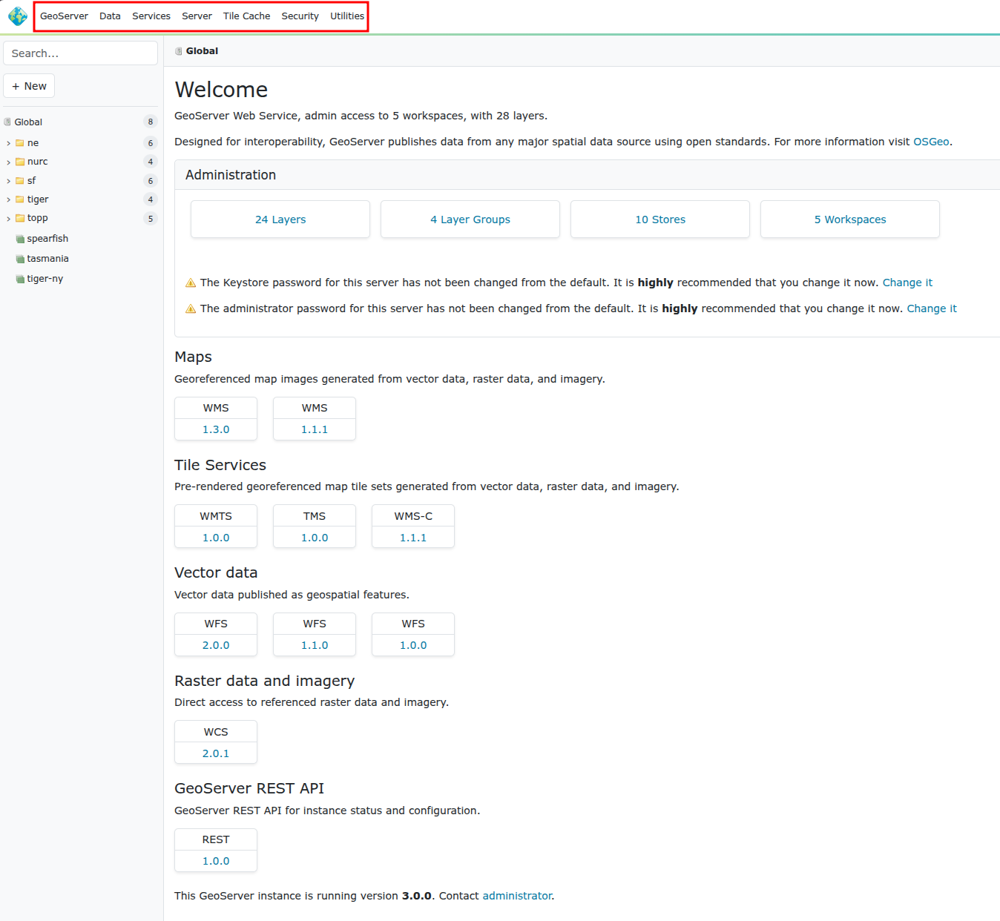

## **GeoServer-valikko**

Avaa **GeoServer**-valikko ja tutki, mikä GeoServer-versio sinulla on käytössä ja mitkä muiden asennettujen ohjelmistojen versiot ovat. Tämäntyyppiset tiedot ovat tärkeitä palvelimen ongelmia selvitettäessä, tapahtuipa ongelmatilanteiden ratkaiseminen omatoimisesti taikka tukipalvelun avulla. 

## **Data-valikko**

Tämä valikko sisältää GeoServerin tärkeimtä toimintoja. Aineistot lisätään ja määritellään tämän valikon kautta.

### **Workspaces**

**Workspace** on GeoServerin tapa säilyttää ja järjestää viittaukset aineistoihin (**Stores**). Aineistot itse on tallennettu hakemistoon (tai tietokantaan), johon GeoServerillä on käyttöoikeudet.

Tyypillisesti samassa workspacessa pidetään samanlaisia ja/tai samasta lähteestä saatuja aineistoja. Esimerkiksi organisaation aineistot voidaan järjestää teemojen mukaan workspacen avulla (ymparisto, kaavoitus, vaesto, terveys, jne.).

Avaa **Workspaces**-osio. Muutama workspace on valmiiksi luotu GeoServerille:

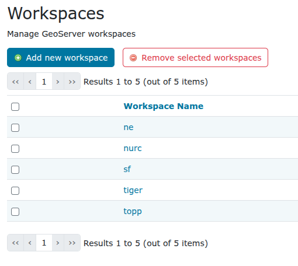

Paina **Add new workspace**.

Luo uusi workspace, jota käytetään jatkossa koulutuksessa, anna sille nimi **helsinki** ja kirjoita **Namespace URI** -kohtaan [**http://gispo.fi/geoserver/helsinki**](http://gispo.fi/geoserver/helsinki):

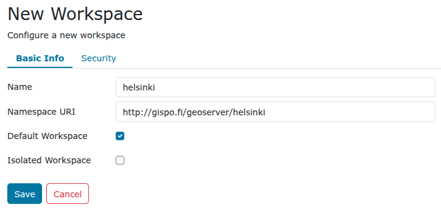

Rastita vielä **Default Workspace**, niin jatkossa juuri luomasi workspace on oletuksena lisättäessä aineistoja ja tasoja GeoServeriin.

::: hint-box
Psst! URI (Uniform Resource Identifier) on teksti, joka määrittelee tietyn resurssin nimen. Se voi olla nettiosoite tai vaikka suhteellinen hakemisto kovalevystä. Ainoa vaatimus on se, että URI:n arvo on yksilöivä. Voit viitata esimerkiksi osoitteeseen tai kansioon, jossa on säilytetty workspaceen liittyvää dokumentaatiota.
:::

Paina **Save** ja olet nyt lisännyt uuden workspacen GeoServerille.

Avaa äsken tekemäsi workspace painamalla **helsinki**-workspace **Workspace Name** -kohdan alta ja huomaa, että lisää valintoja on nyt saatavilla. Palataan niihin myöhemmin säädettäessä workspace-kohtaisia asetuksia.

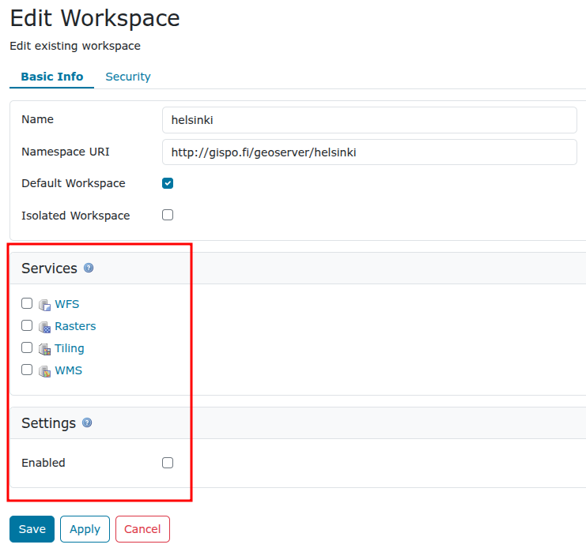

Palaa **Workspace**-näkymään painamalla **Cancel**.

Workspaceja voidaan poistaa valitsemalla yksi tai useampi workspace ja painamalla **Remove selected workspaces** -toimintoa.

### **Stores**

GeoServerillä viitataan aineistolähteisiin **Storesien** avulla. Aineistolähteinä voivat olla yksittäiset tiedostot, tiedostoryhmät, hakemistot, tietokannat tai rajapintapalvelut.

Oletusasennuksessa on valmiina **Store**-viittauksia esimerkkiaineistoihin:

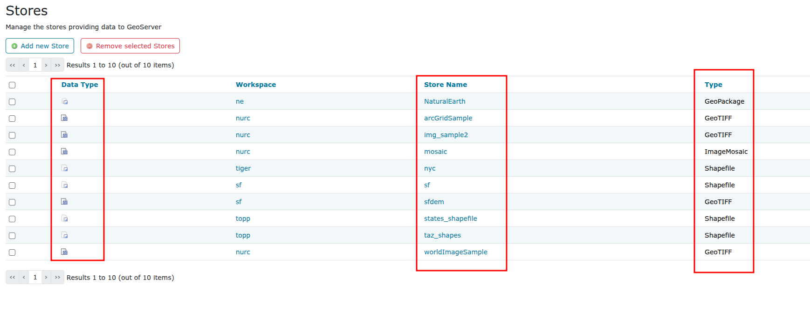

Jokaisen Storen vieressä on kuvake joka viittaa aineiston tyyppiin:

| Ikoni | Aineistotyyppi |
| :---: | :--- |
| ![raster-file][icon1] | Rasteriaineisto tiedostossa |
| ![vector-file][icon2] | Vektoriaineisto tiedostossa |
| ![vector-db][icon3]   | Vektoriaineisto tietokannassa |
| ![wfs][icon4]         | Vektori palvelimelta (Web Feature Server) |

[icon1]: https://docs.geoserver.org/main/en/user/data/webadmin/img/data_stores_type1.png
[icon2]: https://docs.geoserver.org/main/en/user/data/webadmin/img/data_stores_type2.png
[icon3]: https://docs.geoserver.org/main/en/user/data/webadmin/img/data_stores_type3.png
[icon4]: https://docs.geoserver.org/main/en/user/data/webadmin/img/data_stores_type4.png
\
Tutustu muutamaan storen asetuksiin. Esimerkiksi **sfdem** viittaa rasteriaineistoon (huomaa kuvake) ja **taz_shapes** viittaa vektoriaineistoon.

Avaa sfdem-store ja taz_shapes-store. Kirjoita muistiinpanoihisi ylös vastaukset seuraaviin kysymyksiin:

::: hint-box
Mihin aineistoon sfdem-store viittaa?
:::

::: hint-box
Mihin aineistoon taz_shapes-store viittaa?
:::

Huomaa, että [**file:data/**](file:data/){.uri} viittaa GeoServerin Data Directory -hakemistoon. Hakemiston sijainti levyjärjestelmässä löytyy **Server → Server Status** -valikon kautta.

Store **taz_shapes** viittaa hakemistoon, jossa on useampia vektoriaineistoja, tässä tapauksessa .shp-tiedostoja. 

Avaa vielä **taz_shapes**-store ja huomaa, että asetuksissa on rastittu **Enabled**. Se määrittää onko aineisto käytettävissä palvelimelta tai ei. Painamalla **Browse** näet kansiosisällön. 

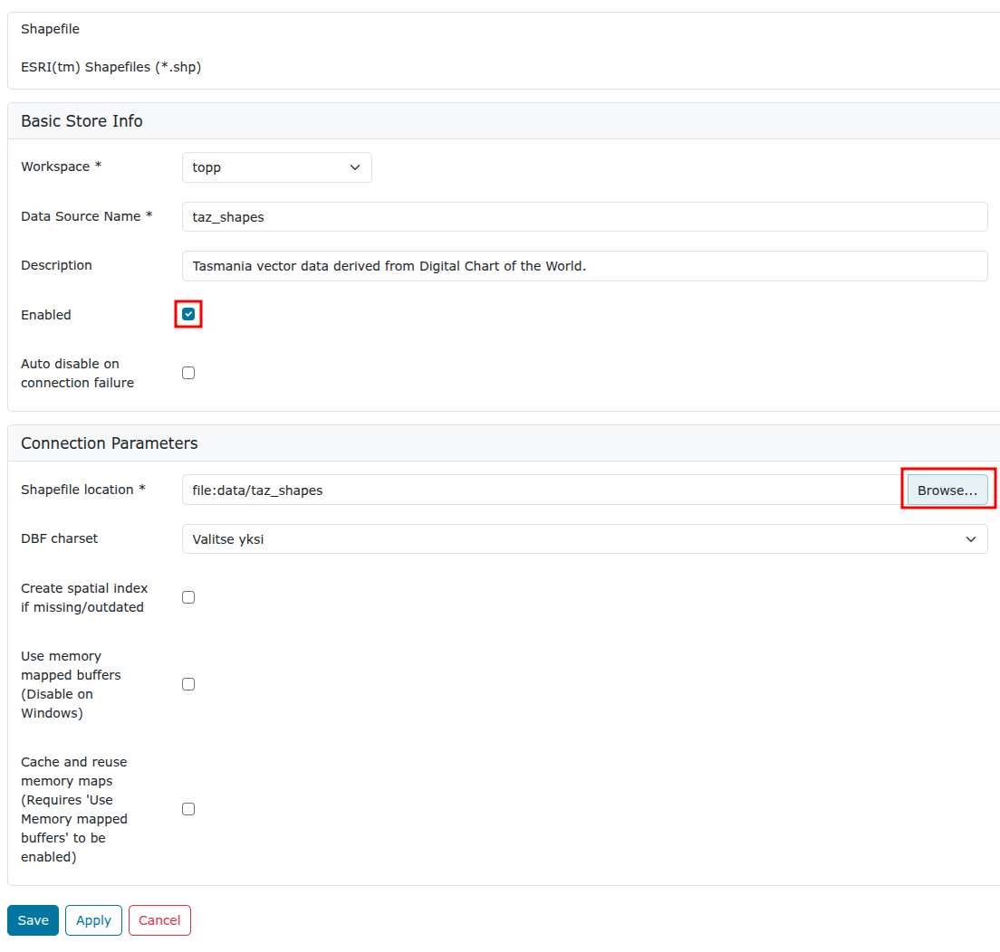

Toisin sanoen haluttaessa estää jonkin aineiston käyttöä GeoServerin kautta, ei tarvitse muuta kun jättää rastittamatta **Enabled**-valinta joko layer-, store- tai jopa workspace-valikossa.\

Nyt kun olet avannut taz_shapes-storen niin GeoServer näyttää sinulle siihen liittyvän workspacen tiedo (huomaat sen sillä että valikoissa on kansio-kuvakkeet). Jotta pääset takaisin globaalinäkymäät voit painaa GeoServer-logoa ylävasemmalla.

### **Layers**

Tasot (**Layers**) määrittelevät yhden aineistolähteen (**Store**) julkaisemisen ominaisuudet, kuten kuvaustekniikan, koordinaattijärjestelmän, metatiedot, palvelun ominaisuudet, karttatiilipalvelun (tile caching) määrittelyt jne.

Yksi taso vastaa yhtä aineistoa. Aineisto voidaan julkaista useisiin eri tasoihin, esimerkiksi eri kuvaustekniikoilla.

**Layers**-näkymässä on mahdollista muokata, lisätä tai poistaa tasoja. **Layers**-näkymän taulukossa on nähtävissä muutama taso ja niiden nimet (**Name**). Taulukossa lukee myös tason otsikko (**Title**) ja missä **Store**ssa aineistot sijaitsevat.

Sarake **Enabled** näyttää tiedon siitä, onko taso käytettävissä palvelimelta vai ei. Huomaa, että käytettävyyden voi määritellä koko storelle (eli aineistolähteelle) tai erikseen tasoille (aineiston näkymille). Myös tason alkuperäinen koordinaattijärjestelmä on ilmoitettu taulukossa, **Native SRS**.

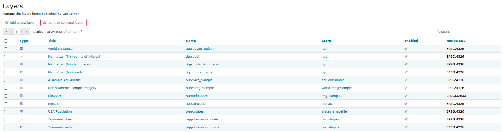

Avaa **Manhattan (NY) landmarks** -tason asetusten näkymä painamalla tason otsikkoa (**Title**) tai nimeä (**Name**) sarakkeesta. 

Tasoon liittyvät asetukset ovat laajat ja siksi ne on jaettu välilehtiin **Data**, **Publishing**, **Dimensions**, **Tile Caching** ja **Security**. 

Tutustu nyt eri välilehtien asetuksiin saadaksesi kuvan siitä, miten tasot määritellään GeoServerillä. Keskustele niistä kouluttajan kanssa.

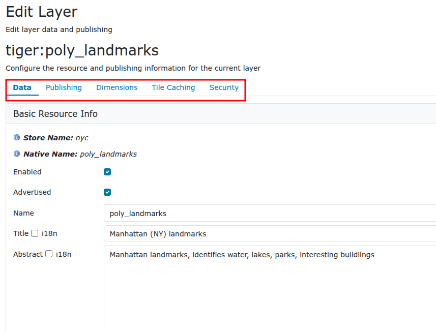

Tutustumme tarkemmin tasoasetuksiin myöhemmin, kun lisäämme omia aineistoja GeoServerille.

## **Layer Groups**

**Layer Groups** -toiminnolla muodostetaan tasoryhmiä. Tasoryhmien avulla on muodostetaan useammasta karttatasosta yhdistettyjä karttatasoja. Tasoryhmiin voidaan lisätä sekä karttatasoja että tasoryhmiä. Muun muassa tasojen järjestystä ja kuvaustekniikoita voidaan määrittää tasoryhmän asetuksissa.

## **Styles**

**Styles**-kohdassa määritellään tasoille (**Layers**) kuvaustekniikka, visualisointi. 

**Styles**-määrittelyjä (kuvaustekniikka) käytetään aina kun tasoja julkaistaan WMS-palveluna. Kuvaustekniikka ei ole riippuvainen tasoista: samaa kuvaustekniikkaa voidaan käyttää useilla tasoilla, ja niillä voi olla useita valinnaisia kuvaustekniikoita.

Avaa **Styles**-valikko, saat näkyviin listan GeoServerilla olevista kuvaustekniikoista.

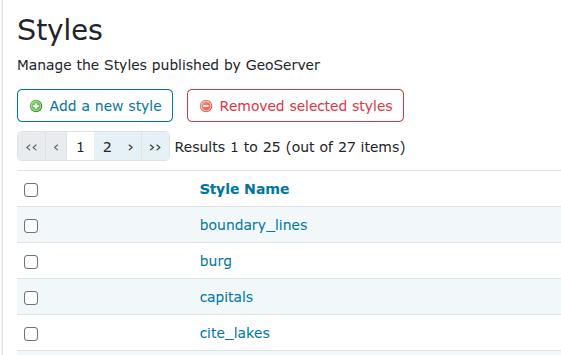

Avaa **giant_polygon**-tyyli ja tutustu GeoServerin käyttämään kuvaustekniikkaformaattiin. Tasojen kuvaustekniikka määritellään käyttäen Styled Layer Descriptor (SLD) -kieltä.

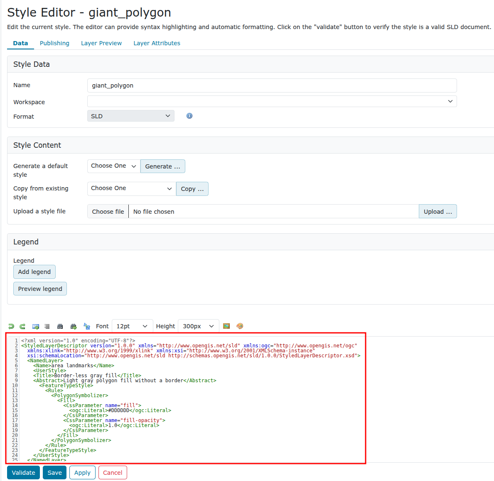

Kuvaustekniikka on hyvin laaja aihe ja siihen tutustutaan erikseen myöhemmin. Kuvaustekniikan toteuttamista voi helpottaa käyttämällä CSS-laajennusta, tätäkin käsitellään myöhemmin koulutuksessa.

## **Services**

GeoServerin rajapintapalvelujen (WFS, WMS ja WCS) yleisasetukset määritellään **Services**-valikon kautta ja näihin tutustutaan tarkemmin myöhemmin.

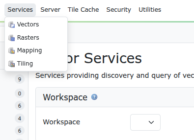

## **Server**

Tässä osiossa voi määritellä palvelimen yleisiä asetuksia.

### **Contact Information**

Päivitetään GeoServerin yhteystiedot. Valitse **Server → Contact Information**.

Täytä omilla tiedoilla ainakin kuvassa merkityt kentät. Nämä tiedot ovat tärkeitä metatietoja GeoServerin ulkopuolisille käyttäjille.

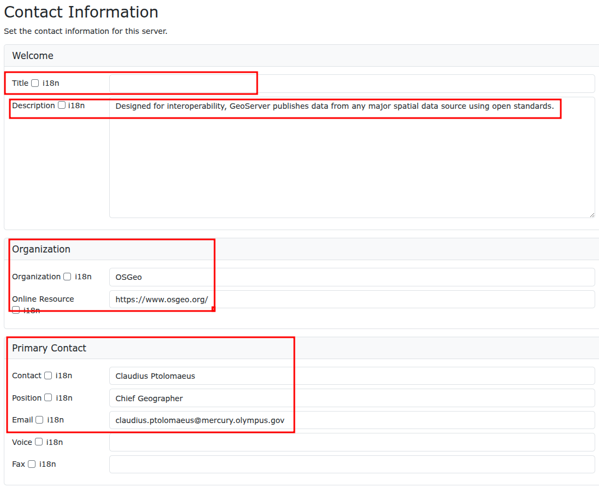

### **Server Status**

Server Status -sivulla on tietoa erilaisista GeoServerin asetuksista ja tilasta. Huomaa esimerkiksi **Data directory** -kansion sijainti.

Kirjoita omiin muistiinpanoihisi palvelimesi **Data directory**:n sijainti, joka ei välttämättä ole sama kuin kuvassa.\

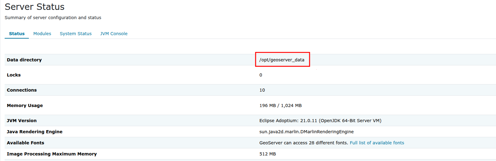

### **Logs**

Logs -valinnan kautta voit katsoa palvelimen lokitietoja. 

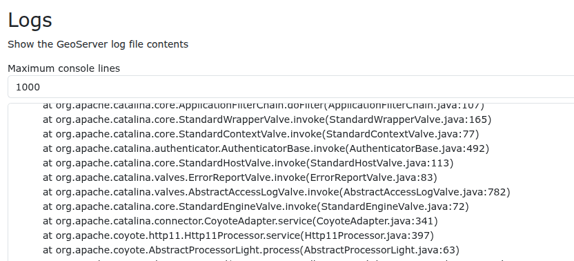

### **Global Settings**

Tämä osio sisältää muun muassa rajapintapalvelujen asetuksia ja lokitietojen asetuksia. 

### **Image Processing**

Tämä osio sisältää Kuvien (WMS-ja WCS-palvelujen) käsittelyyn liittyviä asetuksia. 

### **Raster Access**  
Tämä osio sisältää rasteriaineiston käsittelyyn liittyviä muisti- ja CPU-asetuksia. 

## **Tile Cache**

Tämän valikon kautta määritellään karttatiilipalvelujen (tile caching) asetuksia. Karttatiilipalveluihin ja tämän valikon osioihin tutustutaan tarkemmin myöhemmin.

## **Security**

Valikko sisältää GeoServerin pääsynhallintaan liittyvät asetukset. Huomaa, että muun muassa pääsynhallinta voidaan määrittää sekä käyttäjä-, ryhmä- ja roolikohtaisesti että aineisto- ja palvelukohtaisesti. Vilkaise nyt **Users**, **Groups, Roles** -valikkoa.

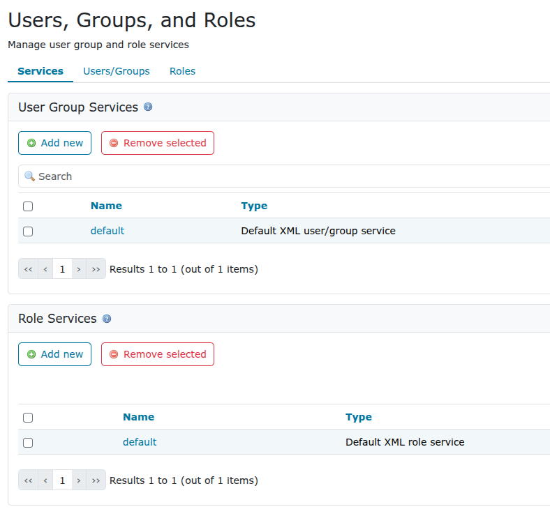

Myös pääsynhallintaa käsitellään tarkemmin myöhemmin.
